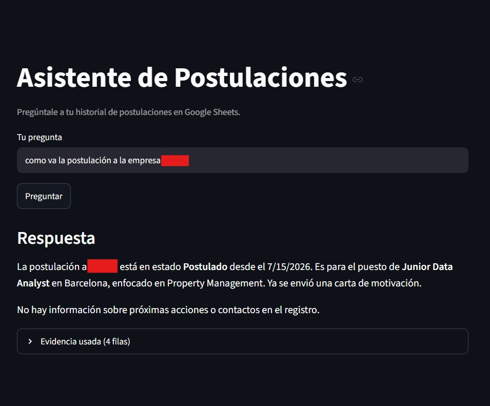

# rag-postulaciones

I track my job applications in a Google Sheet (company, role, status, notes, etc.), and got tired of scrolling through it every time I wanted to remember where some process was at, or which companies got an outdated version of my CV. So I built this: you ask it a question in plain language and it answers based on what's actually in the sheet.

It's not a generic chatbot and it doesn't use some huge model — it's a small, cheap RAG setup: embeddings run locally on your machine, and only the final answer goes through an LLM.



## How it works

1. Reads the applications sheet through the Google Sheets API (service account).
2. Turns each row into text and embeds it with a local multilingual model (`sentence-transformers`, free, no API call).
3. Finds the most relevant rows for your question using a temporary Chroma index.
4. Passes those rows as context to Claude Haiku, which writes the final answer.

Steps 2 and 3 run on your machine for free. The only thing you pay for is step 4, and with Haiku that's fractions of a cent per query.

## Setup

```
pip install -r requirements.txt
cp .env.example .env
```

Fill in `.env`:

- `ANTHROPIC_API_KEY` — from [console.anthropic.com](https://console.anthropic.com/settings/keys)
- `GOOGLE_APPLICATION_CREDENTIALS` — path to a service account with read access to your sheet
- `SPREADSHEET_ID` / `SHEET_NAME` — from your sheet

Then run:

```
streamlit run app.py
```

## Expected sheet structure

One row per application, with columns: `Fecha, Empresa, Puesto, Fuente, Estado, Version_CV, Salario, Contacto, Link_Oferta, Proxima_accion, Notas`.

## Stack

Python · Streamlit · sentence-transformers · ChromaDB · Claude API (Haiku) · gspread
